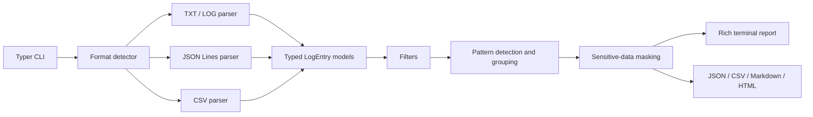

# Support Log Analyzer

[](https://github.com/German4341374/support-log-analyzer/actions/workflows/ci.yml)
[](https://www.python.org/)
[](LICENSE)

Support Log Analyzer is a local, privacy-aware CLI that turns mixed application logs into a
short operational report. It helps support engineers find recurring failures, noisy services,
failure-heavy time windows, and known problem signatures without uploading logs to an external
service.

## Problem

Production log bundles are often large, inconsistent, and unsafe to paste into tickets. Manually
searching them makes it easy to miss a repeated root cause or expose a token in a report. This
tool normalizes common log formats, applies filters, groups volatile variants of the same error,
and masks common sensitive values before presenting examples.

## Features

- Detect TXT/LOG, JSON Lines, and CSV content automatically.
- Recognize common aliases for timestamp, level, service, and message fields.
- Normalize DEBUG, INFO, WARNING, ERROR, and CRITICAL severities.
- Detect timeout, connection refused, access denied, database error, DNS failure,
  authentication failed, and out-of-memory problems.
- Group similar errors while ignoring UUIDs, IPv4 addresses, timestamps, and numeric IDs.
- Count messages, errors, recurring failures, noisy services, first/last timestamps, and errors
  per UTC hour.
- Filter by one or more levels, exact service, message substring, and inclusive time range.
- Mask email addresses, IPv4 addresses, bearer tokens, API keys, and phone numbers.
- Export JSON, CSV, Markdown, and standalone HTML.
- Generate deterministic demonstration logs containing synthetic data only.

## Quick Start

Python 3.12 or newer is required.

```bash
git clone https://github.com/German4341374/support-log-analyzer.git
cd support-log-analyzer
python -m venv .venv
source .venv/bin/activate
python -m pip install -e ".[dev]"
support-log-analyzer generate-demo demo.log --lines 1000
support-log-analyzer analyze demo.log
```

On Windows PowerShell, activate the environment with:

```powershell
.venv\Scripts\Activate.ps1
```

## Command Examples

```bash
support-log-analyzer analyze app.log
support-log-analyzer analyze app.log --level ERROR
support-log-analyzer analyze app.log --level ERROR --level CRITICAL
support-log-analyzer analyze app.log --service api --output report.html
support-log-analyzer analyze events.jsonl --text "connection refused"
support-log-analyzer analyze events.csv --from 2026-07-29T09:00:00Z --to 2026-07-29T12:00:00Z
support-log-analyzer generate-demo demo.log --lines 1000
support-log-analyzer generate-demo demo.jsonl --lines 500 --seed 7
```

Run `support-log-analyzer analyze --help` for every filter and output option.

## Example Report

```text
╭─ Log analysis · demo.log ───────────────╮
│ Messages          1000                  │
│ Errors             251                  │
│ Skipped lines        0                  │
│ First timestamp  2026-07-29 09:00 UTC   │
│ Last timestamp   2026-07-29 22:41 UTC   │
╰─────────────────────────────────────────╯

Most frequent errors
Count  Services       Example
   31  api, gateway   Connection refused by upstream <IPV4> for request 10042
```

Counts vary with the chosen seed, line count, and filters. Exported reports contain the same
masked summary as the terminal view.

## Architecture



The package uses a `src` layout:

- `parsers/` detects formats and maps aliases into canonical entries;
- `analyzers/` applies filters, detects problems, groups messages, and calculates metrics;
- `masking.py` owns privacy-safe substitutions;
- `reports/` renders Rich output and file exports;
- `models.py` contains Pydantic domain contracts;
- `cli.py` translates command options into domain calls and controlled exit codes.

There is no shared analysis state. Each command constructs its filters, parse result, and report
explicitly, which keeps tests isolated and library calls reusable.

## Recognized Fields

Structured JSONL and CSV logs may use these aliases:

| Canonical field | Recognized examples |
| --- | --- |
| timestamp | `timestamp`, `time`, `datetime`, `@timestamp`, `created_at` |
| level | `level`, `severity`, `log_level`, `loglevel` |
| service | `service`, `app`, `component`, `logger`, `source` |
| message | `message`, `msg`, `event`, `text`, `description` |

Naive timestamps are interpreted as UTC. `TRACE`, `NOTICE`, `WARN`, `ERR`, and `FATAL` are mapped
to the closest supported severity. Malformed JSONL/CSV records are skipped and counted; a single
damaged line does not abort the remaining file.

## Docker

Build the pinned, multi-stage image:

```bash
docker build -t support-log-analyzer:local .
```

Analyze a file from the current directory:

```bash
docker run --rm \
  --volume "$PWD:/data:ro" \
  support-log-analyzer:local analyze /data/app.log
```

To write a report, mount a dedicated output directory:

```bash
mkdir -p reports
docker run --rm \
  --volume "$PWD/logs:/logs:ro" \
  --volume "$PWD/reports:/reports" \
  support-log-analyzer:local analyze /logs/app.log --output /reports/report.html
```

The runtime container runs as UID/GID `10001`, contains no compiler or test tools, and does not
need network access.

## Development and Testing

The Makefile targets Linux, macOS, and Windows through WSL2:

```bash
make setup
make format
make lint
make typecheck
make test
make coverage
make docker-build
```

Equivalent direct commands are:

```bash
ruff format --check .
ruff check .
mypy src
pytest
pytest --cov --cov-report=term-missing
pre-commit run --all-files
```

CI repeats formatting, linting, strict type checking, tests with an 85% coverage threshold,
artifact upload, Docker build, and an image smoke test.

## Privacy and Security

- Analysis is fully local and performs no network requests.
- Fixtures use reserved `.test` domains, RFC 5737 documentation IP ranges, and dummy tokens.
- Error examples are masked before terminal display or export.
- Input files and generated reports are ignored by Git by default.
- The Docker process is non-root.
- CI uses read-only repository permissions.

Masking is pattern-based. Review a report before sharing it because custom credential formats,
IPv6 addresses, free-form names, or organization-specific identifiers may require additional
rules.

## Limitations

- Text parsing supports common single-line layouts, not arbitrary multiline stack traces.
- Similarity grouping is deterministic normalization, not semantic or machine-learning
  clustering.
- CSV delimiter detection is limited to commas, semicolons, and tabs.
- Timestamps must be ISO-8601 or Unix timestamps.
- Very large files are currently accumulated in memory before analysis.
- IPv6 and custom secret formats are not masked in version 0.1.0.

## Future Improvements

- Streaming aggregation for multi-gigabyte files.
- Multiline stack-trace and syslog/RFC 5424 parsing.
- Configurable custom problem and masking patterns.
- Compressed `.gz` input.
- Timezone selection and interactive terminal charts.
- Optional similarity thresholds for stack traces with minor wording differences.

## License

Licensed under the [MIT License](LICENSE).

